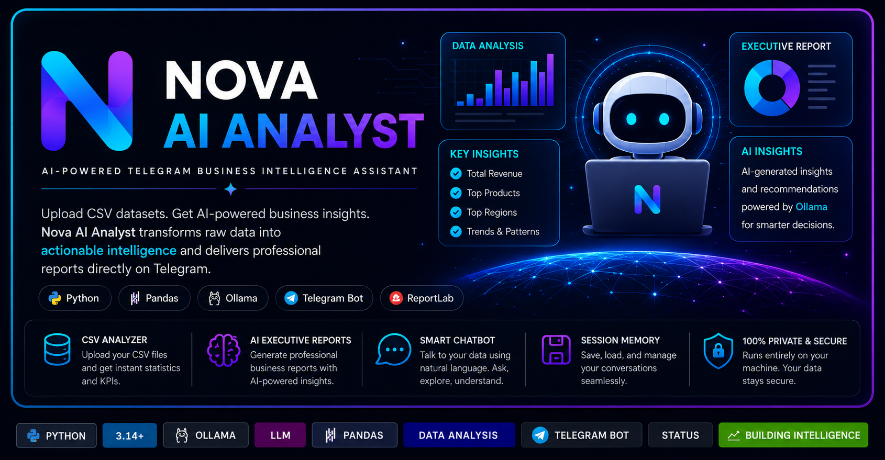
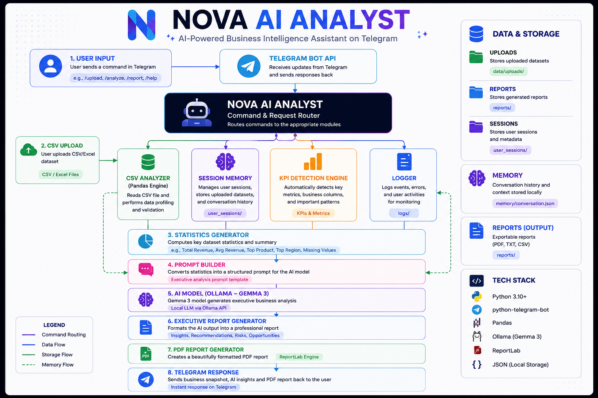
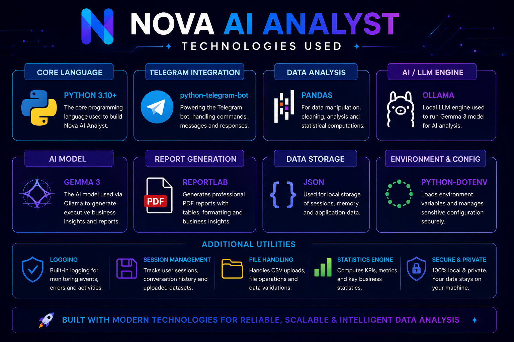
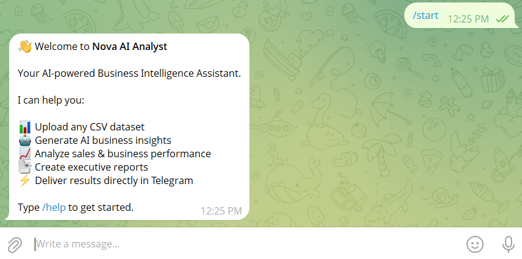
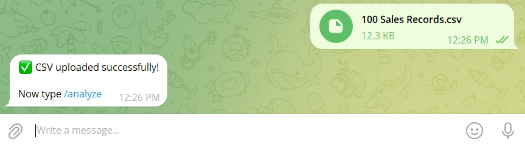
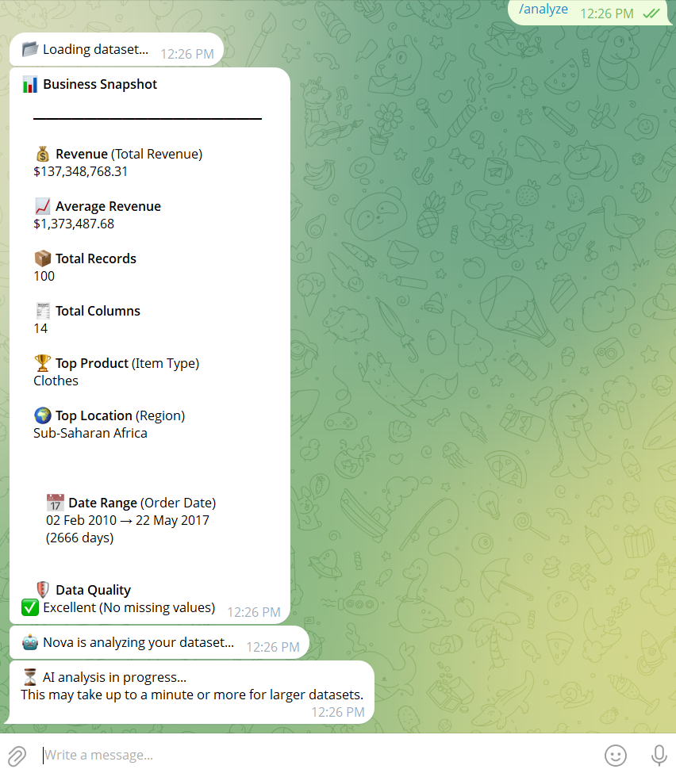
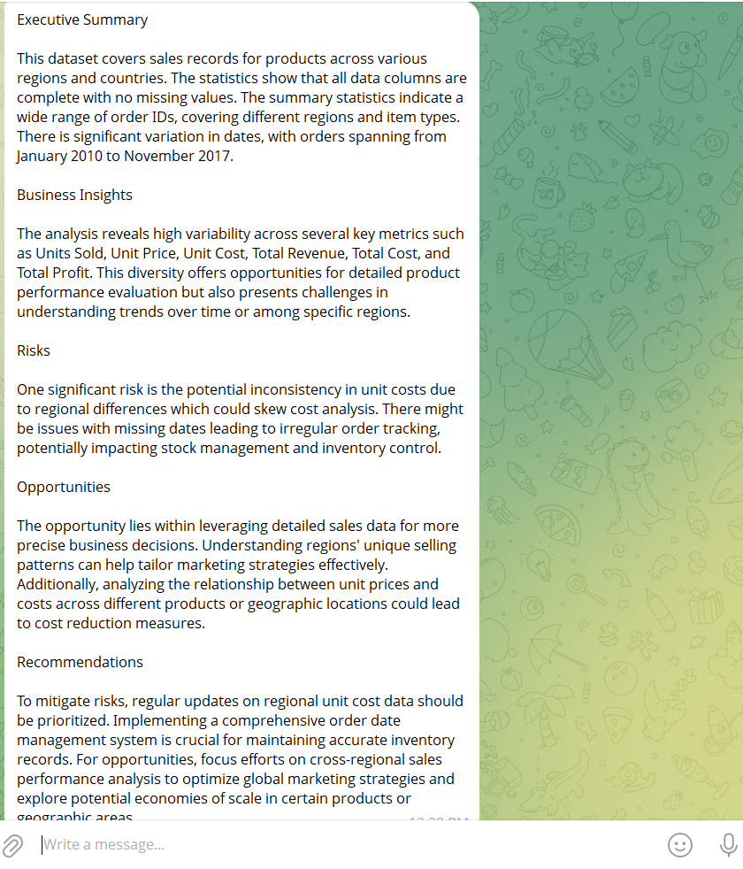
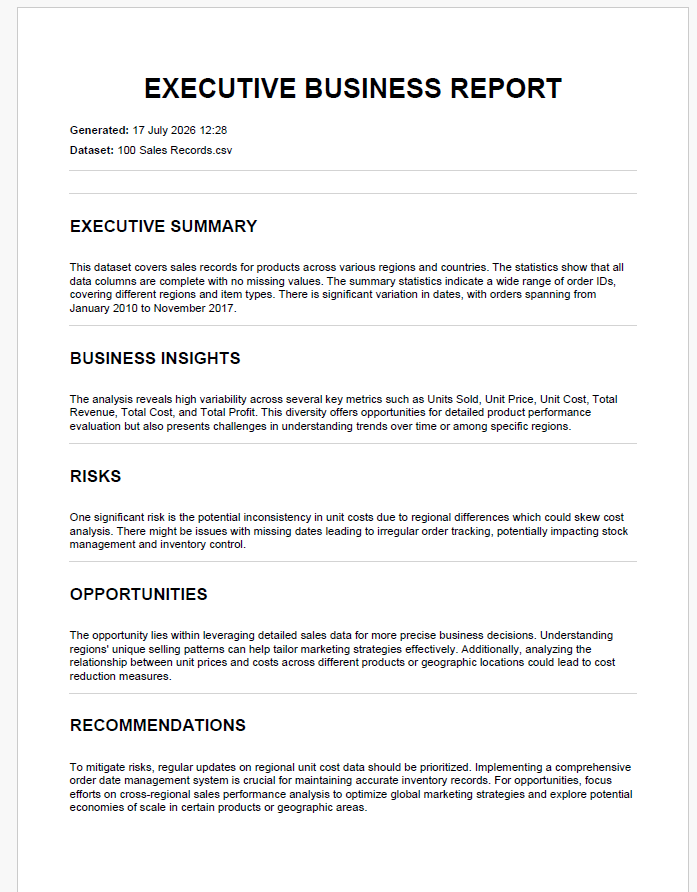
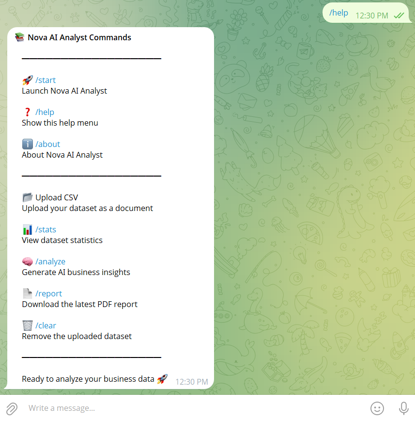
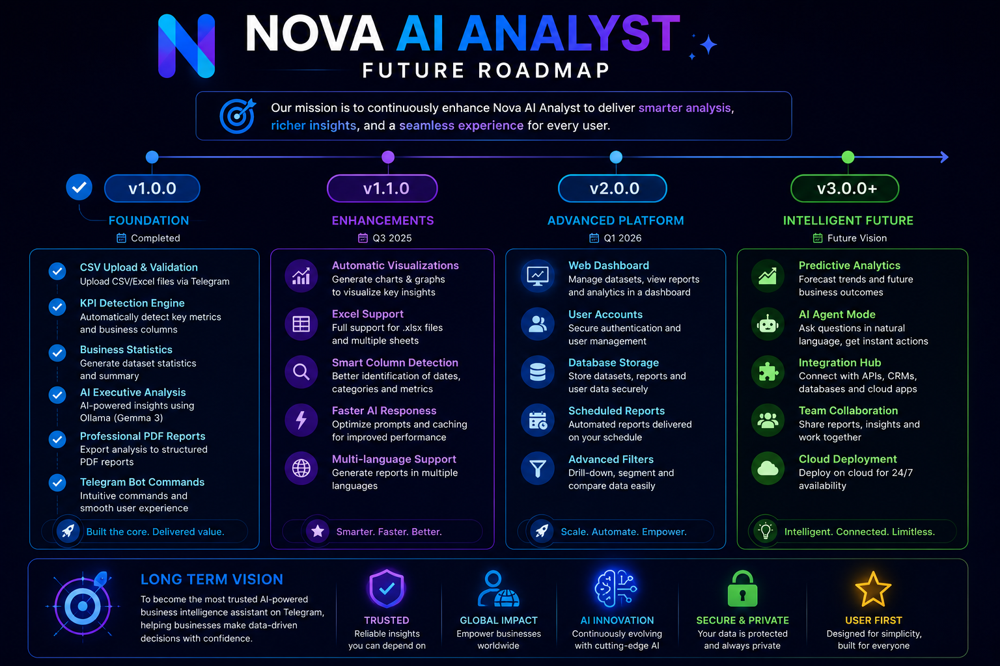

<p align="center">
  
</p>

<h1 align="center">🤖 Nova AI Analyst</h1>

<p align="center">

AI-Powered Business Intelligence Assistant for Telegram

Analyze CSV datasets, generate executive AI reports, detect KPIs automatically, and export professional PDF reports.

</p>

---

# ✨ Features

✅ Upload CSV datasets directly through Telegram

✅ Automatic KPI Detection

✅ AI Executive Business Reports

✅ Professional PDF Export

✅ Dataset Statistics

✅ Smart Business Snapshot

✅ Automatic Date Detection

✅ Missing Value Analysis

✅ Multi-user Support

---

# 🏗 System Architecture

<p align="center">

</p>

Nova AI Analyst is built around a modular AI-powered architecture.

The workflow consists of:

- Telegram Interface
- CSV Processing Engine
- KPI Detection
- Statistics Generator
- Ollama (Gemma 3)
- Executive Report Generator
- PDF Export

---

# 🚀 AI Workflow

1️⃣ Upload CSV

↓

2️⃣ Dataset Validation

↓

3️⃣ Automatic KPI Detection

↓

4️⃣ Statistics Generation

↓

5️⃣ AI Executive Analysis

↓

6️⃣ PDF Report Creation

↓

7️⃣ Delivered inside Telegram

---

# 📊 Technology Stack

<p align="center">

</p>

### Backend

- Python

- Pandas

- python-telegram-bot

---

### AI

- Ollama

- Gemma 3

---

### Reporting

- ReportLab

---

### Storage

- Local Sessions

- CSV Files

- PDF Reports

---

# 📷 Application Preview

## Home



---

## Upload Dataset



---

## Business Snapshot



---

## AI Analysis



---

## Executive Report


---

## PDF Preview



---

## Help Menu



---

# 📈 Project Statistics

| Feature | Status |
|----------|--------|
| CSV Upload | ✅ |
| KPI Detection | ✅ |
| AI Reports | ✅ |
| PDF Export | ✅ |
| Dataset Statistics | ✅ |
| Telegram Bot | ✅ |
| Multi-user Support | ✅ |
| Cloud Deployment | 🔄 Planned |

---

# 🗺 Future Roadmap

<p align="center">

</p>

Upcoming versions include:

- Excel (.xlsx) Support

- Interactive Charts

- Web Dashboard

- Database Integration

- Predictive Analytics

- Cloud Deployment

- Team Collaboration

---

# ⚡ Installation

```bash
git clone https://github.com/yourusername/Nova_AI_Analyst.git

cd Nova_AI_Analyst

pip install -r requirements.txt
```

---

## Start Ollama

```bash
ollama serve
```

---

## Pull Gemma

```bash
ollama pull gemma3
```

---

## Configure

Create a `.env`

```env
BOT_TOKEN=your_telegram_bot_token
MODEL_NAME=gemma3
```

---

## Run

```bash
python main.py
```

---

# 📂 Project Structure

```text
Nova_AI_Analyst/
│
├── analyzers/
├── bot/
├── data/
├── memory/
├── nova_ai/
├── reports/
├── screenshots/
├── utils/
│
├── handlers.py
├── main.py
├── requirements.txt
└── README.md
```

---

# 👨‍💻 Developer

**Edet Simon**

Computer Scientist

Data Analyst

AI Developer

Business Intelligence Enthusiast

---

# ⭐ Support

If you enjoyed this project,

⭐ Star the repository

🍴 Fork it

🐛 Report Issues

🤝 Contribute

---

# 📄 License

MIT License